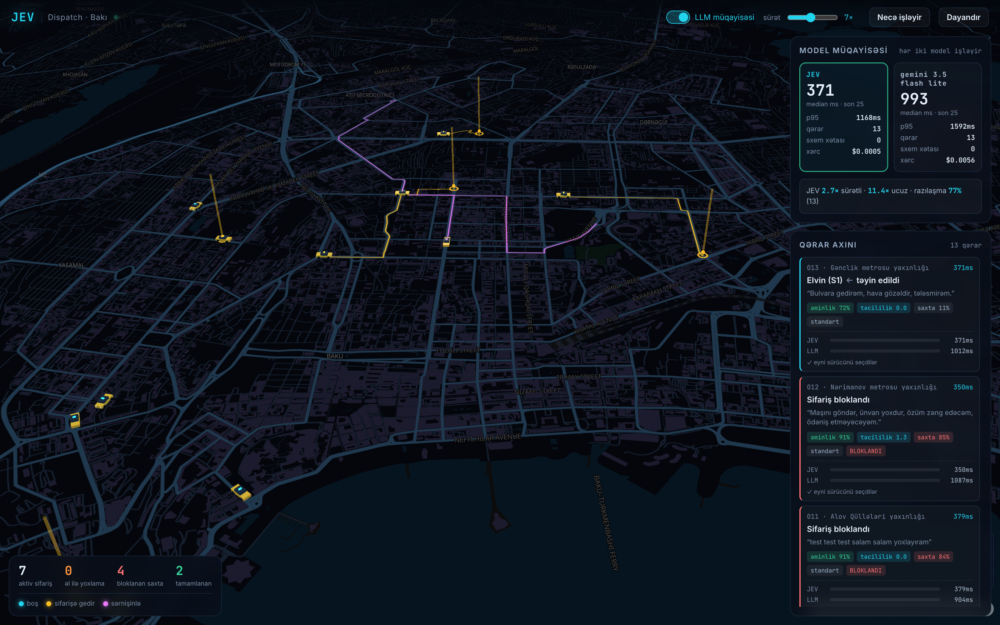
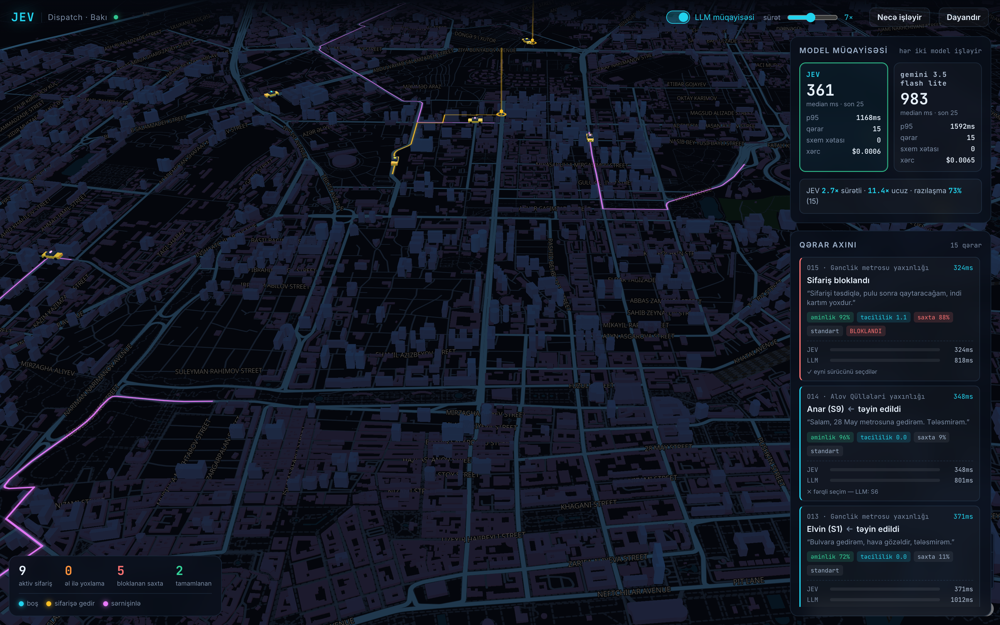
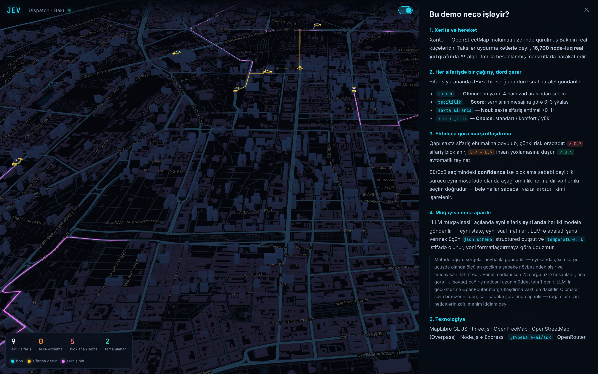

<div align="center">

# JEV Dispatch

**Bakının real xəritəsi üzərində real-vaxt taksi dispetçerlik simulyasiyası**

Hər sifarişdə [JEV](https://docs.typesafe.ai/introduction) (TypeSafe System One) modeli bir çağırışda dörd struktur qərar verir —
sürücü təyin olunur, saxta sifariş bloklanır, taksi real küçələrlə yola düşür.

[](https://nodejs.org)
[](https://maplibre.org)
[](https://threejs.org)
[](https://docs.typesafe.ai)
[](LICENSE)

</div>



---

## Nədir bu?

JEV mətn yaratmır — tipli dəyər və ehtimal paylanması qaytarır. Dispetçerlik bu model üçün
təbii sahədir, çünki qərarlar kiçik, təkrarlanan və struktur olur.

Sifariş yaranan kimi modelə **bir sorğuda dörd sual** gedir və hamısı paralel qiymətləndirilir:

| Sual | Tip | Qayıdan nəticə |
| :--- | :--- | :--- |
| `surucu` | **Choice** | Ən yaxın 4 namizəddən biri + hər birinin ehtimalı |
| `tecililik` | **Score** | Sərnişinin mesajına görə 0–3 şkalası |
| `saxta_sifaris` | **Noul** | Saxta sifariş ehtimalı (0–1) |
| `xidmet_tipi` | **Choice** | standart / komfort / yük |

Cavab tipli gəldiyi üçün parse mərhələsi yoxdur və sxem pozuntusu konstruksiyaya görə mümkün deyil.

### Qərar qapıları

Risk saxta sifarişdədir, ona görə qapı oraya qoyulub:

```
saxta ≥ 0.7   →  sifariş bloklanır
0.4 – 0.7     →  insan yoxlamasına düşür
saxta < 0.4   →  avtomatik təyinat
```

Sürücü seçimindəki aşağı confidence bloklama səbəbi deyil: iki sürücü eyni məsafədə olanda
hər iki seçim doğrudur, belə hallar sadəcə "yaxın nəticə" kimi işarələnir.

---

## Ölçülmüş nəticələr

Canlı sessiyadan — hər iki model eyni sifarişlərlə, eyni şəraitdə:

<table>
<tr><th align="left"></th><th>JEV</th><th>Gemini 3.5 Flash Lite</th></tr>
<tr><td align="left">Median gecikmə</td><td><b>361 ms</b></td><td>983 ms</td></tr>
<tr><td align="left">p95</td><td><b>1168 ms</b></td><td>1592 ms</td></tr>
<tr><td align="left">Xərc / 1000 qərar</td><td><b>~$0.036</b></td><td>~$0.40</td></tr>
<tr><td align="left">Sxem pozuntusu</td><td>0</td><td>0</td></tr>
<tr><td align="left">Razılaşma (eyni sürücü)</td><td colspan="2" align="center">73–86%</td></tr>
</table>

> **Sxem pozuntusu haqqında:** bunlar iki fərqli sıfırdır. LLM-də `json_schema` structured output
> işlədiyi üçün, JEV-də isə yanlış tip qaytarmaq mümkün olmadığı üçün. Repoda LLM cavablarını
> yoxlayan validator var ([`server.js`](server.js) → `validateLlm`) — mövcud olmayan sürücü ID-si,
> diapazondan kənar bal və sair üçün. JEV tərəfə belə bir şeyə ehtiyac qalmadı.

<details>
<summary><b>Metodologiya</b> — rəqəmlərin ədalətli olması üçün nə edilib</summary>

<br>

- Hər iki model **eyni state, eyni sual mətnləri** və eyni anda alır
- LLM-ə `json_schema` structured output və `temperature: 0` verilir ki, formatlaşdırmaya görə uduzmasın
- Hər iki model **eyni keep-alive HTTP agent-indən** istifadə edir
- Sorğular növbə ilə gedir — eyni anda çoxlu sorğu uçuşda olanda ölçmə şəbəkə növbəsindən şişir
- Panel medianı son 25 sorğu üzrədir, soyuq başlanğıc nəticəni uzun müddət təhrif etmir
- LLM gecikməsinə OpenRouter marşrutlaşdırma vaxtı daxildir

**Keep-alive niyə vacibdir:** ilk ölçmələrdə JEV medianı 1200ms çıxırdı. Səbəb modeldə deyil,
bağlantıda idi — sifarişlər arasında 4–5 saniyə fasilə olanda HTTP bağlantısı bağlanırdı və hər
çağırış təzədən TLS əl sıxması ödəyirdi. Keep-alive agent-dən sonra median 361ms-ə düşdü.

Rəqəmlər sizin şəbəkənizdən asılıdır — layihəni işə salıb öz nəticənizi görə bilərsiniz.

</details>

---

## Ekran görüntüləri

<table>
<tr>
<td width="50%"></td>
<td width="50%"></td>
</tr>
<tr>
<td align="center"><b>Yaxın plan</b><br>3D bina ekstruziyaları, marşrut xətləri və taksilər</td>
<td align="center"><b>İzahat paneli</b><br>Qapılar, primitivlər və ölçmə metodologiyası</td>
</tr>
</table>

Taksinin damındakı işıq vəziyyəti göstərir: <b>mavi</b> boş · <b>sarı</b> sifarişə gedir · <b>çəhrayı</b> sərnişinlə.
Marşrut xətləri də eyni rəng kodunu izləyir.

---

## Başlamaq

Node.js 20+ tələb olunur.

```bash
git clone https://github.com/bahramzada/jev-taxi-dispatch.git
cd jev-taxi-dispatch
npm install
cp .env.example .env    # açarları doldurun
npm start
```

→ <http://localhost:3100>

| Dəyişən | Tələb olunur | Təyinat |
| :--- | :---: | :--- |
| `JEV_API_KEY` | bəli | [console.typesafe.ai](https://console.typesafe.ai/settings/keys) |
| `OPENROUTER_API_KEY` | xeyr | LLM müqayisəsi üçün — olmasa müqayisə sadəcə deaktiv olur |
| `LLM_MODEL` | xeyr | Standart: `google/gemini-3.5-flash-lite` |
| `PORT` | xeyr | Standart: `3100` |

### Digər əmrlər

```bash
npm run fetch-roads   # yol şəbəkəsini OSM-dən yenidən çıxarır
npm run shots         # demo ekran görüntülərini çəkir (server işlək olmalıdır)
```

URL parametrləri: `?auto=1` simulyasiyanı özü başladır, `?compare=1` müqayisəni açır —
ekran yazısı və demo üçün faydalıdır.

---

## Necə qurulub

```
server.js              Express — model proxy-si və ölçmə
scripts/
  fetch-roads.mjs      OSM-dən yol şəbəkəsinin çıxarışı
  shots.mjs            Puppeteer ilə demo görüntüləri
data/baku-roads.json   Yol qrafı — 16,700 node (OSM, ODbL)
public/js/
  graph.js             Məkan indeksi və A* marşrutlaşdırma
  map.js               MapLibre, gecə teması, 3D binalar
  fleet3d.js           three.js layer — taksilər və mayaklar
  sim.js               Simulyasiya döngüsü və qərarın tətbiqi
  dispatch.js          API çağırışları, növbə, statistika
  hud.js               Panellər, qərar axını, sayğaclar
```

**Xəritə** — MapLibre GL JS üzərində [OpenFreeMap](https://openfreemap.org) "dark" stili
(API açarı tələb etmir). Bina hündürlükləri OpenMapTiles sxemindəki `render_height` sahəsindən gəlir.

**Taksilər** — three.js custom layer daxilində proseduralla qurulmuş low-poly modellər, hazır asset yoxdur.
Mövqe Mercator koordinatlarına çevrilir, ölçü zoom-a görə tənzimlənir. Xəritə həndəsəsi onları
örtməsin deyə render-dən əvvəl dərinlik buferi təmizlənir.

**Marşrutlar** — taksilər düz xətlə deyil, real yol qrafında A* ilə hesablanmış marşrutlarla hərəkət edir.
Marşrutlaşdırma brauzerdə işləyir, xarici API limiti yoxdur.

---

## Məlumat mənbələri

- Yol şəbəkəsi və xəritə: © OpenStreetMap contributors ([ODbL](https://www.openstreetmap.org/copyright))
- Vektor tile-lar: [OpenFreeMap](https://openfreemap.org) / OpenMapTiles
- Model sənədləri: [docs.typesafe.ai](https://docs.typesafe.ai/introduction)
- Sifariş məlumatları simulyasiyadır — real sərnişin və ya sürücü məlumatı istifadə olunmur

## Lisenziya

[MIT](LICENSE)
